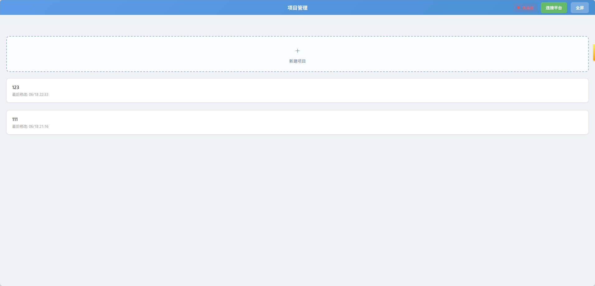
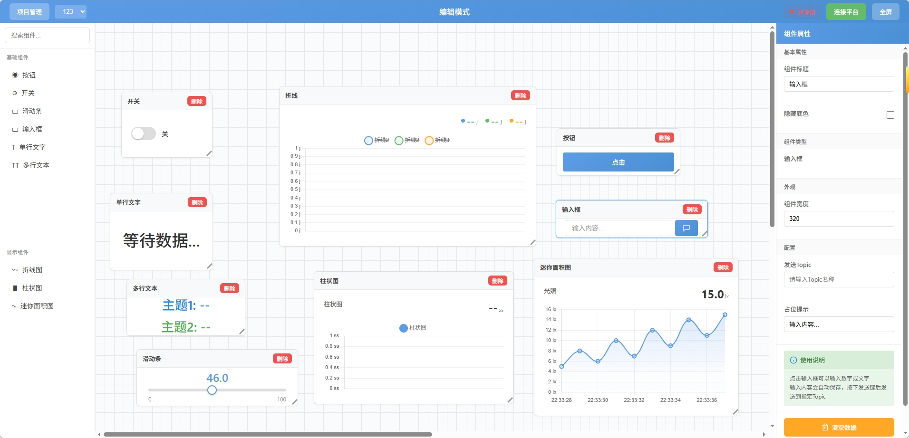

<div align="center">

# 自制IOT物联网显示面板（iot-visualization）

[](https://github.com/mio-kitten/iot-visualization)
[](https://github.com/mio-kitten/iot-visualization)
[](https://vuejs.org/)
[](https://www.electronjs.org/)
[](https://www.typescriptlang.org/)

一个基于 **Vue 3** + **Electron** 开发的物联网数据可视化工具

</div>

---

## 说明

| 项目 | 详情 |
| --- | --- |
| **所用技术栈** | Vue 3、Electron 28+、TypeScript、Chart.js、MQTT.js、Vite |
| **已支持的平台** | Windows 7 及以上 |
| **组件数量** | 9 个 |
| **状态** | 开发中 |

---

## 项目简介

本项目以 Mind+ 可视化面板中的组件为灵感，对组件内部配置进行了优化，相比于 Mind+ 原有版本更具扩展性和实用性。

### 项目管理界面



---

## 注意事项

作为仿制作品，使用时请注意以下几点：

1. **本仓库包含所有程序源码，并未进行打包处理**（如果将来有机会会压缩成 ZIP）

2. **运行方式**：
   - 直接下载本项目所有文件并放在任意文件夹
   - 点击 `检查安装依赖.bat`，程序会自动调用文件夹中的 Node.js 安装包进行安装
   - 如果安装失败，请手动运行 `node-v24.16.0-x64.msi` 安装包
   - 安装完成后，**不要再点击"检查安装依赖"**，直接运行 `一键启动.bat`

3. **环境要求**：本项目基于 Vue 与 Node.js 开发，需要网页环境支持

4. **组件支持**：能力有限，目前仅实现了 9 个组件：
   - BarChartWidget（柱状图）
   - ButtonWidget（按钮）
   - InputWidget（输入框）
   - LineChartWidget（折线图）
   - MiniAreaWidget（迷你面积图）
   - SliderWidget（滑动条）
   - SwitchWidget（开关）
   - TextWidget（文本）

### 编辑界面



5. **已知问题**：滑动条组件存在问题暂未修复（虽然可能也不怎么用）

---

## 开发命令

```bash
# 安装依赖
npm install

# 开发模式
npm run dev

# 构建生产版本
npm run build

# 启动 Electron
npm run electron:start

# 打包 Electron 应用
npm run electron:build
```

---

## 使用限制

一、本项目完全免费，且开源发布于 GitHub 面向全世界人用作对技术的学习交流。本项目不对项目内的技术可能存在违反当地法律法规的行为作保证。

二、禁止在违反当地法律法规的情况下使用本项目。对于使用者在明知或不知当地法律法规不允许的情况下使用本项目所造成的任何违法违规行为由使用者承担，本项目不承担由此造成的任何直接、间接、特殊、偶然或结果性责任。

---

## 非商业性质

三、本项目仅用于对技术可行性的探索及研究，不接受任何商业（包括但不限于广告等）合作及捐赠。

---

## 接受协议

四、若你使用了本项目，即代表你接受本协议。

---

## 许可证

MIT License